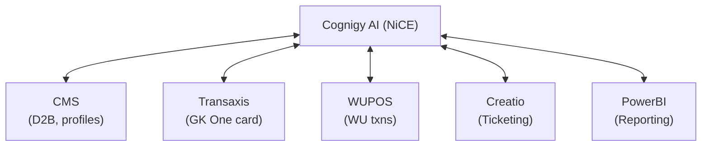
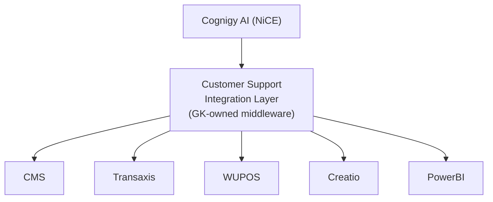

# CSC Optimisation — Architecture Decision: Integration Layer

## The Question

How does Cognigy AI (NiCE) integrate with GraceKennedy's backend systems?

Two options are on the table:

---

## Option A: Direct Feature Integration (Each feature answers for itself)

- Cognigy integrates directly with each backend system
- GKIT features (D2B, CMS lookups) expose their own APIs that Cognigy calls
- GKOne features (card status, Transaxis) expose their own APIs that Cognigy calls
- Each feature team owns their integration contract with NiCE

**Pros:**
- Simpler for each team — they control their own API surface
- Feature teams can evolve APIs independently
- Fewer moving parts per integration (direct call)
- Easier to attribute failures to specific systems

**Cons:**
- Cognigy needs to know about N systems (currently 5: CMS, Transaxis, WUPOS, Creatio, PowerBI)
- Each new use case potentially means a new integration for NiCE to build
- NiCE has visibility into internal system boundaries (security/governance concern?)
- Harder to enforce consistent auth, rate limiting, logging across all integrations
- 32 KB payload limit applies per integration — no opportunity to aggregate/slim responses centrally

**Testing implications:**
- Need to test each integration independently
- Failure modes are per-system (CMS down vs Transaxis down vs WUPOS down)
- Test data setup spans multiple systems
- Contract testing per API surface

---

## Option B: Customer Support Integration Layer (Single gateway)

- GraceKennedy builds/owns a single integration layer
- Cognigy talks only to this one layer
- The layer orchestrates calls to CMS, Transaxis, WUPOS, etc.
- Feature teams expose internal APIs to the layer, not to NiCE directly

**Pros:**
- NiCE has a single integration point — simpler contract, fewer credentials
- GK controls what data NiCE sees (security/privacy boundary)
- Can aggregate multiple system calls into one response (e.g., identity + D2B status + card status in one call)
- Central place to enforce auth, rate limiting, logging, payload shaping
- Can handle the 32 KB payload limit by slimming/filtering responses before they reach Cognigy
- Easier to add new use cases — just add endpoints to the layer, no new NiCE integration work
- Feature teams are insulated from NiCE's requirements/constraints
- Single point for monitoring and alerting

**Cons:**
- Additional system to build, deploy, and maintain (new infrastructure)
- Single point of failure — if the layer is down, all AI interactions are affected
- Extra network hop = additional latency per request
- Layer team becomes a bottleneck for new feature integrations
- Debugging is harder — is the issue in Cognigy, the layer, or the backend?
- Requires a team/owner for the layer (who maintains it?)

**Testing implications:**
- Integration testing focuses on one API surface (layer ↔ Cognigy)
- Backend testing is behind the layer (layer ↔ CMS/Transaxis/WUPOS)
- Failure simulation is centralized (can mock the layer to test Cognigy behaviour)
- But also need to test layer itself against backends
- Performance testing must account for the extra hop

---

## Questions to drive the decision

1. **Who owns the integration?** Does GK have a team/capacity to build and maintain a middleware layer?
2. **How many use cases/systems will grow over time?** If it's going from 5 to 15 integrations, the layer pays for itself. If it stays at 5, maybe not worth it.
3. **Security posture:** Is NiCE (external vendor) having direct access to CMS/Transaxis/WUPOS acceptable? Or must there be a GK-owned boundary?
4. **Latency budget:** What's the acceptable response time for the AI? Can it tolerate an extra hop?
5. **32 KB constraint:** Are any of the current API responses at risk of exceeding 32 KB? Would a layer help by filtering/shaping?
6. **Contract change frequency:** How often do CMS/Transaxis APIs change? Would a layer absorb those changes without touching Cognigy?
7. **Existing infrastructure:** Does GK already have an API gateway or integration platform (e.g., Azure API Management, MuleSoft) that could serve as this layer?
8. **NiCE's preference:** Has NiCE expressed a preference? The SDD lists direct integrations — does that imply Option A is their assumption?

---

## Impact on testing strategy

| Concern | Option A (Direct) | Option B (Layer) |
|---------|-------------------|------------------|
| Test environments needed | CMS, Transaxis, WUPOS, Creatio stubs per system | Layer mock + real layer + backend stubs |
| Failure isolation | Clear — which system failed | Ambiguous — layer vs backend |
| Performance testing | Per-integration | End-to-end through layer |
| Security testing | Validate each integration's auth | Validate layer auth + layer-to-backend auth |
| Regression scope | Change to one system only affects its tests | Change to layer could affect all use cases |
| Test data management | Spread across systems | Can potentially centralise via layer |
